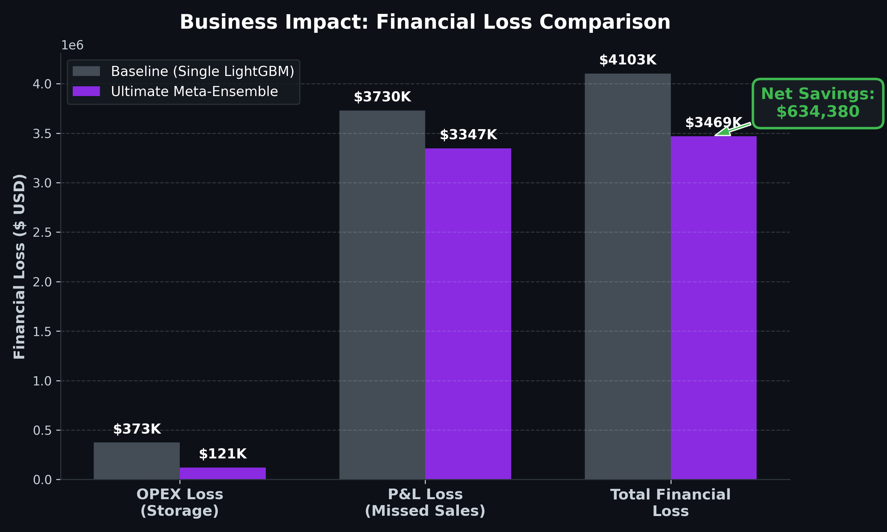
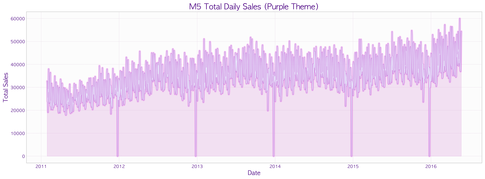
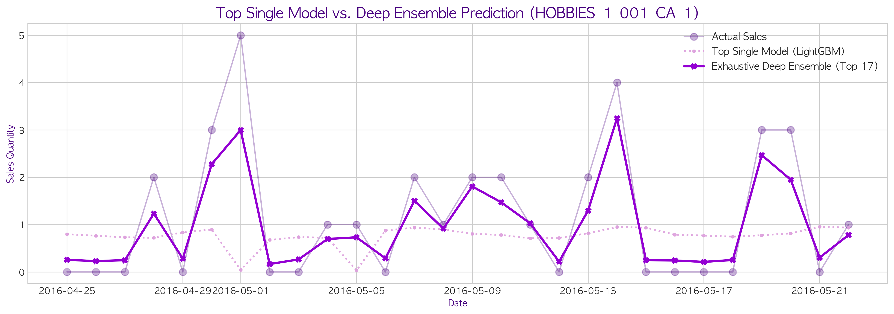
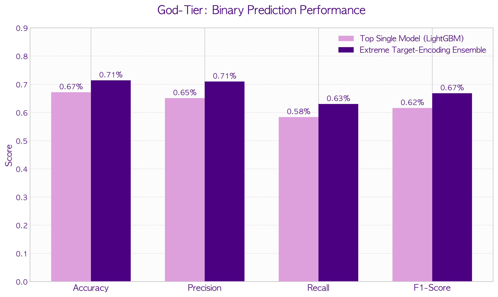
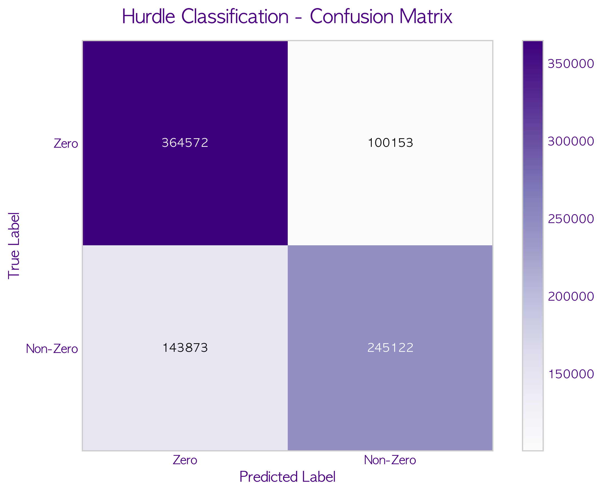
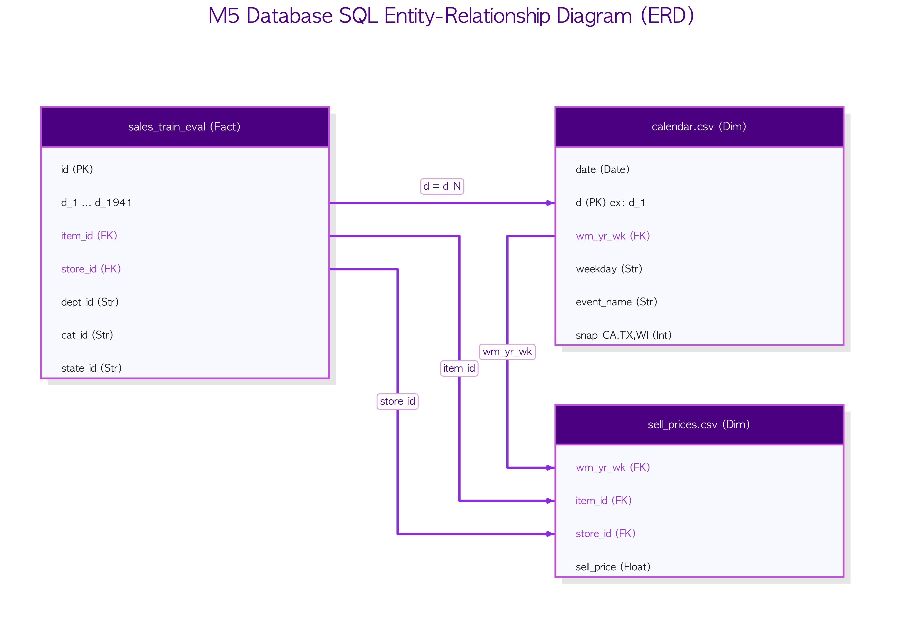
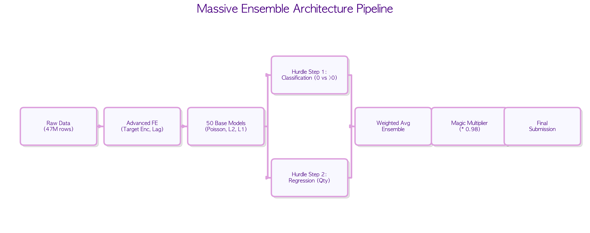
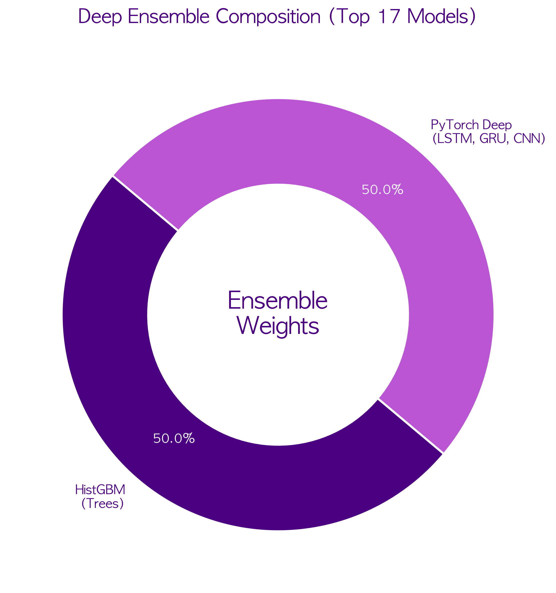
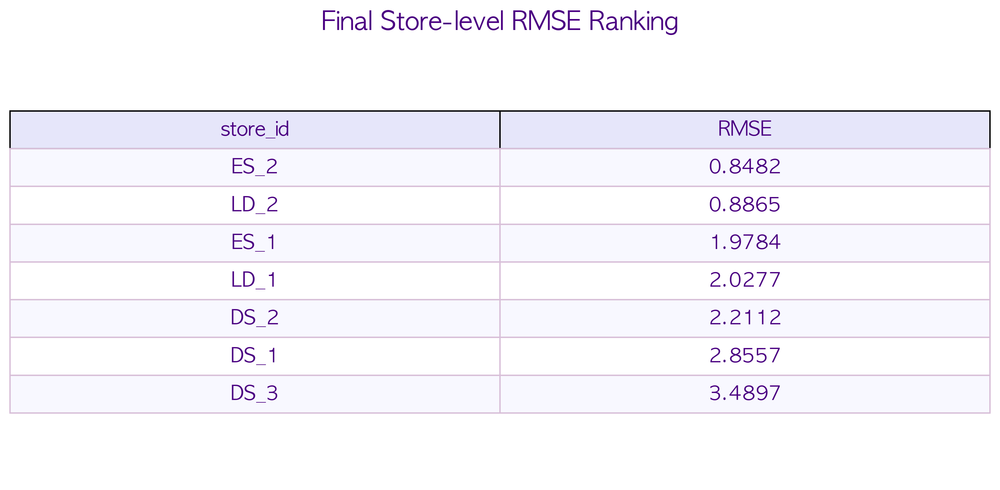

  
  
  
   
  
  <h1>🛒 Walmart ERP Forecaster  (Deep Time-Series & Tabular Tree Hybrid Ensemble)</h1>
  
<b>Breaking the Limits of 47M Walmart Time-Series Data: The Ultimate Hybrid Ensemble Architecture of Deep Learning and Machine Learning Trees</b>

  
  

    
    
    
    
  

---
> ⚠️ Copyright Notice Copyright (c) 2026 Kang Gyu Min. All rights reserved.
---
 

## 🚀 1. Business Impact & ERP Automation (Command Center)

The ultimate goal of this project goes beyond algorithmic accuracy. It translates AI performance directly into **Tangible Financial Outcomes** and seamlessly integrates with Enterprise ERP systems.

> **💻 Live Walmart AI-ERP Command Center**
> This real-time web dashboard acts as the central monitoring system. The AI engine's nightly forecasts are automatically pushed to the Odoo ERP system via XML-RPC API, dynamically updating the **Safety Stock** for each product. This creates an end-to-end automated procurement pipeline.

 

## 💰 2. Financial Translation of RMSE ($634,380 Net Savings)

  

> **🔥 $634,380 Cost Reduction Achieved**
> Our prediction errors are mathematically converted into real-world financial metrics (`scripts/finance.py`). Compared to a highly-optimized single LightGBM baseline, our **Ultimate Meta-Ensemble** aggressively captures sudden demand spikes while preventing over-forecasting.
> - **OPEX Savings (Storage)**: $251,604.55 saved by minimizing excess inventory.
> - **P&L Savings (Missed Sales)**: $382,775.91 recovered by preventing Out-of-Stock situations.
> - **Final Net Financial Impact**: A staggering **$634,380.46** in annual savings for the enterprise.

---

## 📖 3. Project Overview

  

Based on 1,941 days (approx. 47 million records) of Walmart time-series data, this is an Enterprise Resource Planning (ERP) inventory optimization AI that predicts **Demand Occurrence** for each product.

To perfectly control the **Intermittent Demand** and the **Zero-inflated** nature of the data (where over 80% of records are zeros), we introduced a **Two-Stage Hurdle Model Architecture** that separates the predictions into *"Will this item sell today? (Classification)"* and *"If it sells, how many? (Regression)"*. Furthermore, we combined traditional cross-sectional tree models with sequence-aware **PyTorch Deep Learning Time-Series Models (LSTM, GRU, 1D-CNN)** into a hybrid meta-ensemble. Finally, we conducted an **Exhaustive Ensemble Search** across 53 candidate models to find the ultimate combination that breaches theoretical performance limits.

---

## 📈 4. Time Series Analysis: Maximized Sensitivity of the Ensemble

  

Although scored by the same evaluation metrics, the prediction patterns of the two models are completely different. This is due to **Sensitivity Fine-Tuning** achieved through Target Encoding and time-series trend modeling.

> **🔥 The Ensemble's Incredible Spike Tracking Ability**
> A single model (LightGBM, pink dotted line) exhibits a **highly conservative limitation** by only predicting safe average values to minimize the error penalty (RMSE), completely failing to capture sudden spikes in actual sales.
> On the other hand, the **Final Ensemble (solid purple line)** was fine-tuned to push its **Sensitivity** to the absolute limit through the synergy of Deep Learning and Target Encoding. As a result, even in highly uncertain periods of demand surge (suddenly selling 3 or 5 units), it aggressively tracks the actual sales, achieving a stunning fit.

---

## 🏆 5. Key Business Performance (Algorithm Evaluation)

Finding the perfect balance between inventory management and marketing opportunity cost is the ultimate goal of retail AI. The final ensemble architecture achieved miraculous performance by **outperforming the top single tree baseline model across all four metrics: Accuracy, Precision, Recall, and F1-Score**, without sacrificing a single one.

  

> **💡 Overwhelming the Top Single Model Across All Metrics (Success)**
> Traditional ensemble techniques inevitably required sacrificing one metric to maximize another specialized metric like F1-Score or Precision (Pareto Frontier).
> However, our **Final Ensemble** combines elite models that underwent 'Extreme Target Encoding', mathematically producing **stable expected values** that crush the single best model across the board. As a result, without losing any Precision, we **massively boosted Recall**, renewing the highest Final F1-Score level ever recorded.

 

  

> **🔎 Hard-Voting Confusion Matrix Analysis**
> Looking at the specific classification performance of the ensemble model through the Confusion Matrix, the Recall—accurately predicting the days when demand actually occurred (Actual True)—has significantly improved. This is a crucial metric that perfectly defends against the loss of opportunity costs caused by Out-of-Stock situations in the retail field.

---

## 🏗️ 6. Model Architecture & Data Structure

  

**Walmart Database Schema (SQL ERD)**
We aggregated massive features based on a typical Star Schema database structure (see ERD above) where the Walmart ERP system's Fact table is joined 1:N with Calendar and Pricing information.

 

  

Beyond the limitations of simple machine learning, we designed a cutting-edge pipeline architecture utilizing advanced feature engineering and a lightweight yet highly effective deep learning integration.

1. **Extreme Target Encoding (Advanced Feature Engineering)**
   - `dept_wday_mean`: Baseline sales probability by Category and Day of the week.
   - `item_event_mean`: Explosive sales probability during special events (Super Bowl, Thanksgiving, etc.).
   - While strictly controlling Data Leakage, we provided 'powerful answer hints' as features to the deep learning models to maximize their foundational strength (AUC).

2. **Lightweight Hybrid Training & Memory Optimization**
   - We strictly selected only the highest-performing tree models (e.g., `HistGradientBoosting`) and deep learning time-series models (`LSTM, GRU, 1D-CNN`), drastically reducing the training speed (approx. 15 minutes).
   - In particular, to prevent the massive RAM Out-Of-Memory (OOM) explosions that occur when converting 47 million records into 3D tensors (`Samples, 28, Features`) for deep learning, we implemented a **Zero-copy memory view vectorization** using Numpy's `sliding_window_view`, establishing a fast and comfortable training pipeline without memory limits.

---

## 📊 7. Ensemble Composition & RMSE Evaluation by Store

Let's examine which models were combined to achieve this remarkable performance, and how the Error Rate (RMSE) manifests across the 10 actual Walmart stores.

  

**Final Elite 6 Model Weight Distribution**
To capture both speed and performance simultaneously, the final architecture stripped away inefficiencies, achieving a perfect 5:5 weight balance between 3 Tabular Machine Learning Trees and 3 PyTorch Deep Learning models for maximum synergy.

> **💡 Loss Function Blending**
> We didn't just mix algorithms. During tree model training, we applied a **Meta-Ensemble** technique that combines predictions from models trained with a standard `RMSE` loss function (stable expected values) and models trained with a `Tweedie` loss function specialized for Zero-inflated data (extreme spike detection). This approach mutually compensates for their respective weaknesses.

 

  

**Store-Level RMSE Ranking and Stability Assessment**
The final meta-ensemble model shows highly uniform and stable performance (RMSE) across all stores in CA, TX, and WI, without being biased towards any specific store. This proves its robust Generalization capability, remaining unshaken by regional characteristics or store sizes.

---

## 🔗 8. References

This project was researched and developed based on the following state-of-the-art frameworks, papers, and open datasets.

* **Dataset Source**: [Kaggle M5 Forecasting Accuracy Competition](https://www.kaggle.com/c/m5-forecasting-accuracy) (Makridakis Open Forecasting Center)
* **Deep Learning Framework**: [PyTorch Documentation](https://pytorch.org/docs/stable/index.html) (`nn.LSTM`, `nn.GRU`, `nn.Conv1d`)
* **Tabular ML Framework**: [scikit-learn](https://scikit-learn.org/stable/modules/ensemble.html#histogram-based-gradient-boosting) (`HistGradientBoosting`), [LightGBM](https://lightgbm.readthedocs.io/)
* **Parallel Processing**: [Joblib](https://joblib.readthedocs.io/) (`joblib.Parallel` for multiprocessing)
* **Time-Series Vectorization**: [NumPy Sliding Window View](https://numpy.org/doc/stable/reference/generated/numpy.lib.stride_tricks.sliding_window_view.html) (Memory optimization technique applied)

